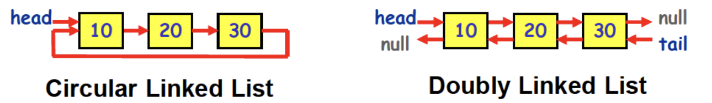
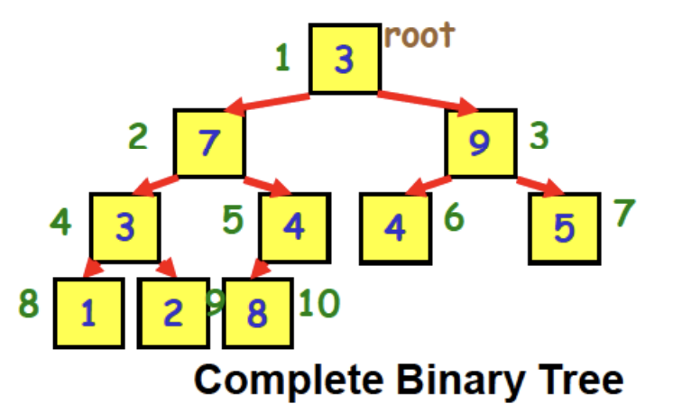
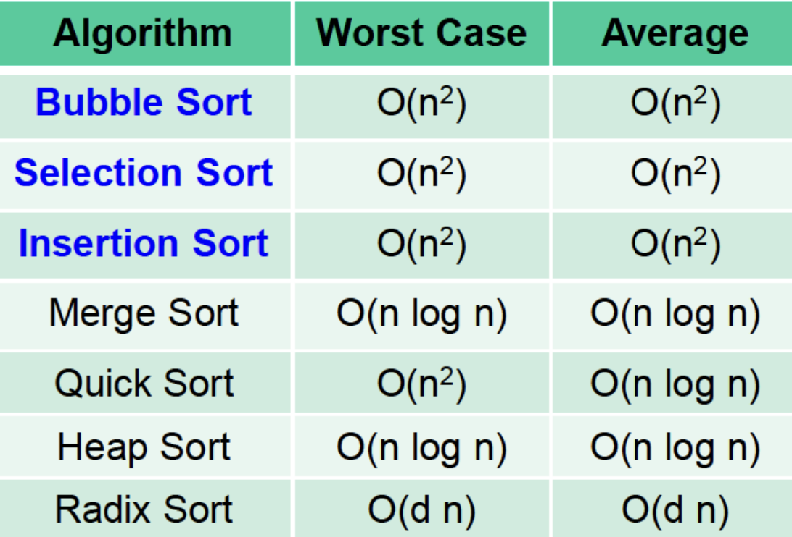

Abstract Data Type: 어떻게 동작하는가?(구체적 구현X)  
Data Structure: 물리적 형태, 실질적인 구현  
알고리즘: 문제를 해결하기 위한 절차  
  
Linear Data Structure: Stack, Queue, Deque, Array List, Linked List  
Nonlinear Data Structure: Tree, Heap, Graph
#### ✅ Array
여러개의 변수를 저장  
배열의 길이 찾기  
```cpp
int length = sizeof(a) / sizeof(a[0]);
```
배열에 넣거나 뺄 때: 한칸씩 밀어야함 --> O(n) 
Dynamic Array: 크기가 모자라면 배열의 크기를 두배로 키워서 새로운 값을 넣음(STL vector도 이렇게 함(visual studio에서는 1.5배로 해서 기존에 썼던 인접한 메모리 주소를 다시 쓸 수 있는 가능성이 생겨서 효율이 좋을수도)) 
#### ✅ Set
중복X, 순서X
Union: 합집합(중복된 값 한번만 들어감)  
InterSection: 교집합  
Difference: 차이 ex) A - B  
#### ✅ Tree
Binary Tree: 자식이 최대 2개(배열로 구현하기 편함)  
Complete Binary Tree: 위에서 아래로+왼쪽부터 채움, 배열로 구현했을 때 빈 공간이 없음(일반적인 트리는 링크드리스트로 만듦)  
  
부모노드로: 1/2배  
왼쪽 자식노드: 2배  
오른쪽 자식노드: 2배 + 1
#### ✅ Graph
인접행렬(배열) or 인접리스트(링크드리스트)로 구현  
방향성 고려해야함
#### ✅ Sorting
Bubble Sort: 인접한 두 값을 비교해서 순서가 안 맞으면 SWAP O(n^2)  
Selection Sort: 한 바퀴 돌 때마다 최소값 or 최대값 찾음 O(n^2)  
Insection Sort: 정렬 안된 배열에서 하나씩 값을 가져와서 정렬 된 배열의 적절한 위치에 삽입함 O(n^2)  
#### ✅ Search Alforithm
Linear Search: 순차적으로 찾음 O(n)  
Binary Search: 정렬된 배열에서 계속 중간 값을 보면서 찾고자 하는 값보다 크면 왼쪽 작으면 오른쪽을 봄 O(logN)  
#### ✅ Selection
k번째 작은 값 찾기(중간값, 최대값, 최솟값 등)  
중간값: 크기가 홀수--> 중간값, 크기가 짝수 --> 두 중간값의 평균  
  


